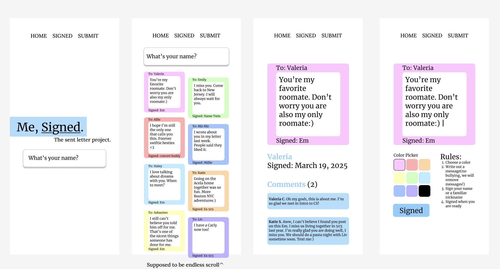
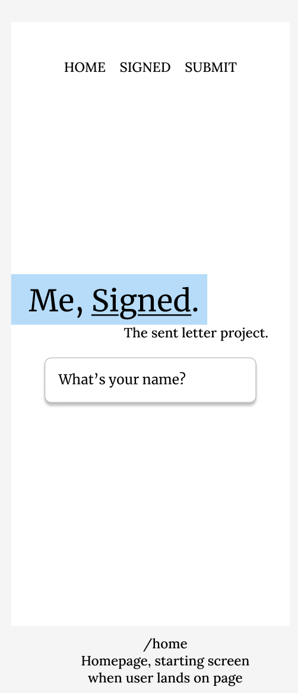
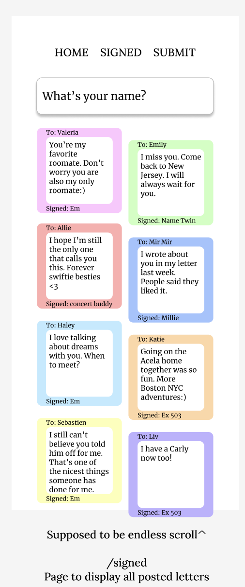
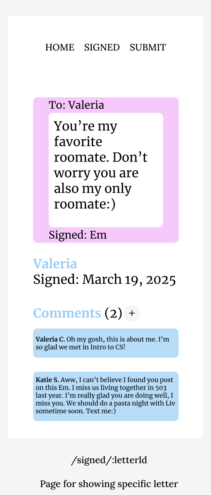
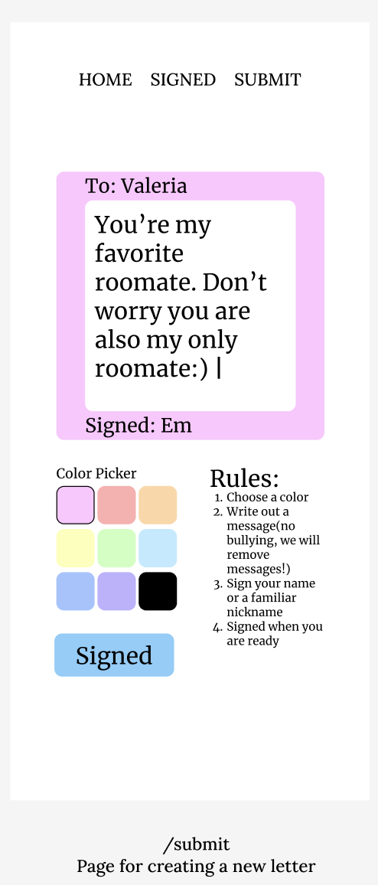
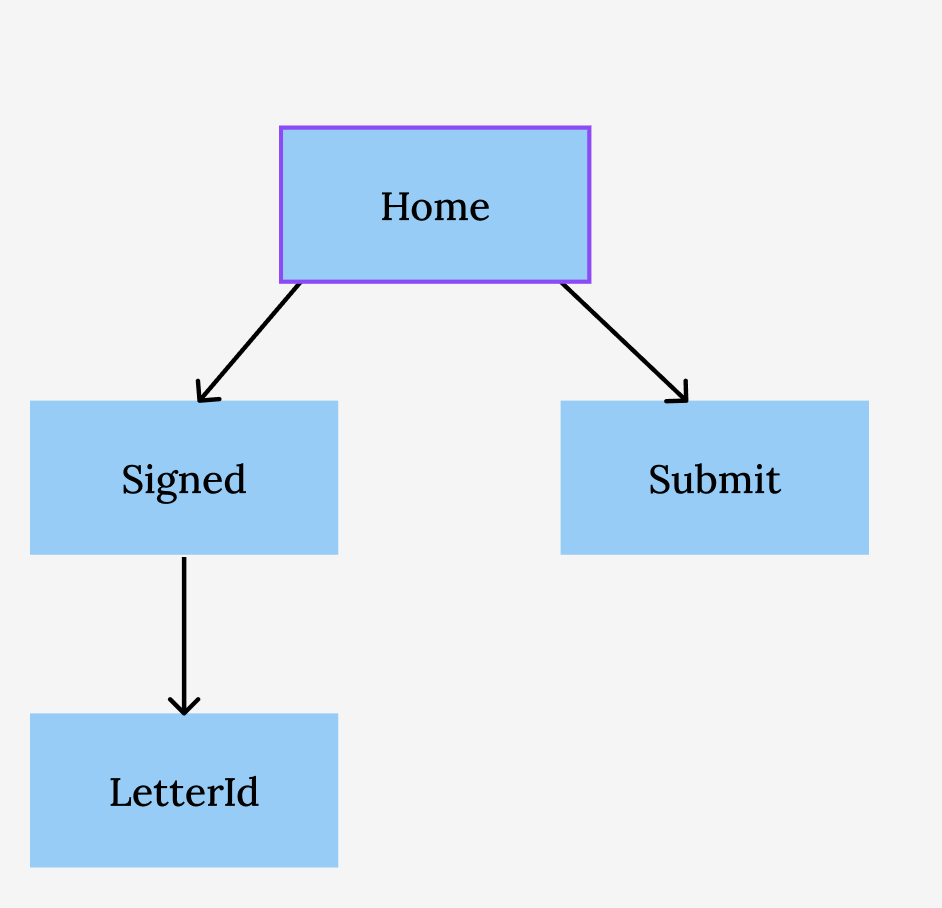

# Me, Signed

## Overview

"Me, Signed." is a web app that allows users to create and sign letters, sharing their thoughts publicly rather than sending direct messages. Users can create & sign a letter with their real name or psudonym. Once the user signs a letter, the letter will appear on the main SIGNED page, with the most recent letters displayed at the top. Users can search for a specific name or keyword, dynamically refreshing the page with matching letters. Finally, users can also click into a specific letter, where the letter will be on the page with the date it was posted and a comment section for further engagement.

Unlike a messaging app, "Me, Signed." doesn't facilitate direct conversations between individuals. Instead, it creates a shared space for open letters, allowing users to sign and send their words into the world for anyone to read and respond to. 

By signing each letter, "Me, Signed." hopes to promote authenticity and vulnerable connections, allowing users to take ownership of their feelings rather than leaving feelings unsaid. We are moving past the era of unsent feelings. This platform will initiate a new era of signing feelings.

## Data Model

The application will store Letters and Comments

* users can post multiple letters
* each letter will have a comment section where users post multiple comments
* each comment will reference a letter object with its _id field, linking it to a specific letter

An Example letter:
```javascript
{
  recipient: "valeria",
  name: "Em",
  description: "You’re my favorite roomate. Don’t worry you are also my only roomate:)",
  color: "pink",
  createdAt: // {timestamps: true}creates a createdAt time stamp field
}
```

An Example Comment:

```javascript
{
  firstName: "Valeria",
  lastInitial: "C"
  content: "Oh my gosh, this is about me. I’m so glad we met in Intro to CS!"
  letter: //a reference to a Letter object
}
```

## [Link to Commented First Draft Schema](db.mjs) 


## Wireframes 

/home - Homepage, starting screen when user open web app



/signed - Page to display all posted letters



/signed/:letterId - Page for showing specific letter



/submit - Page for creating a new letter



## Site map


## User Stories or Use Cases

1. as a user, I can search for a name or keyword on the Home page to find relevant letters.
2. as a user, I can view all letters posted by myself and others on the Signed page.
3. as a user, I can search for a name or keyword on the Sign page to find relevant letters.
4. as a user, I can click on a specific letter on the Signed page to view its full content, including the date posted and comments, on the LetterId page.
5. as a user, I can add a comment to a specific letter on the LetterId page.
6. as a user, I can create and post a new letter on the Submit page, which will be added to the Signed page.

## Research Topics

(__TODO__: the research topics that you're planning on working on along with their point values... and the total points of research topics listed)

* (6 Points) Integrate React
    * I'm going to be using React as part of my frontend
    * React's reusable components makes it easier to create a dynamic, interactive UI where letters update in real-time.
    With React’s state and props, I can efficiently and easily manage form submissions, searching letters, and displaying 
    comments without full-page reloads.
    * I will be able to create a reusable component for each page: Home, Signed, LetterId(specific letter page), and Submit.
    * React's own React Router DOM will help me with navigation across my different pages
    * I could use useEffect to fetch letters from my MongoDB database instantly when the component loads
    * I can use useState to store list of letters and easily update my "state" for dynamically rendering the page
* (3 Points) Vite
    * Vite is another frontend build tool that allows for faster development when paired with frameworks like React
    * Vite uses Hot Module Replacement(HMR), which allows developers to see changes almost instantly without full page reloads
* (2 Points) Integrate tailwind.css
    * Tailwind CSS is a utility-first CSS framework 
    * This allows developers to apply styles directly in React JSX using utility classes for rapid UI development
    * This eliminates the need to write separate custom stylesheets
    * I can use hover: and focus: states to enhance user interaction (ex: highlighting letters on hover)

## [Link to Initial Main Project File](https://github.com/nyu-csci-ua-0467-001-002-spring-2025/final-project-deployment-emilyh1011/blob/master/server/app.mjs) 
 
## Annotations / References Used

